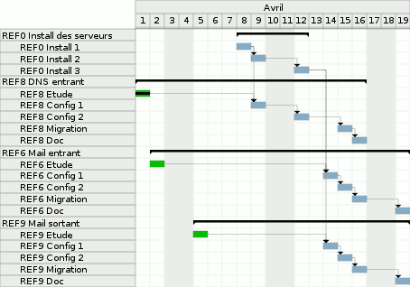

About Pla
=========

Is a tool for building gantt charts in format PNG, EPS, PDF or SVG.
My original usage of this code is for building automatically LaTeX documents.

[Original project page](https://www.arpalert.org/pla.html)



[PDF Gantt chart example](pla.pdf)

Build
=====

This buils needs include file and libs for

cairo (http://cairographics.org/)
Just type "make". Maybe you can adjust path in the makefile.

Command line help
=================

```
pla -i <filename> [-o <filename>] [-f (eps|png|svg|pdf)]
    [-s yyyymmdd] [-e yyyymmdd] [-id task_id] [-oid task_id]
    [-res] [-did] [-gid]

    -res: display resources
    -did: display id
    -gid: return first free id
```

Planning describe file
====================== 

```
[4] REF0 Install des serveurs
	color #8cb6ce
	child 1
	child 2
	child 3

	[1] REF0 Install 1
		start 2010-04-08 01
		duration 24
		color #8cb6ce
		dep 2
		dep 6
	
	[2] REF0 Install 2
		start 2010-04-09 01
		duration 24
		color #8cb6ce
		dep 3
	
	[3] REF0 Install 3
		start 2010-04-12 01
		duration 24
		color #8cb6ce
		dep 12
		dep 18
	
[10] REF8 DNS entrant
	color #8cb6ce
	child 5
	child 6
	child 7
	child 8
	child 9

	[5] REF8 Etude
		start 2010-04-01 01
		duration 24
		percent 100
		color #00cc00
		dep 6

	[6] REF8 Config 1
		start 2010-04-09 01
		duration 24
		color #8cb6ce
		dep 7
	
	[7] REF8 Config 2
		start 2010-04-12 01
		duration 24
		color #8cb6ce
		dep 8
	
	[8] REF8 Migration
		start 2010-04-15 01
		duration 24
		color #8cb6ce
		dep 9
	
	[9] REF8 Doc
		start 2010-04-16 01
		duration 24
		color #8cb6ce
	
[16] REF6 Mail entrant
	color #8cb6ce
	child 11
	child 12
	child 13
	child 14
	child 15

	[11] REF6 Etude
		start 2010-04-02 01
		duration 24
		color #00cc00
		dep 12
	
	[12] REF6 Config 1
		start 2010-04-14 01
		duration 24
		color #8cb6ce
		dep 13
	
	[13] REF6 Config 2
		start 2010-04-15 01
		duration 24
		color #8cb6ce
		dep 14
	
	[14] REF6 Migration
		start 2010-04-16 01
		duration 24
		color #8cb6ce
		dep 15
	
	[15] REF6 Doc
		start 2010-04-19 01
		duration 24
		color #8cb6ce
	
[22] REF9 Mail sortant
	color #8cb6ce
	child 17
	child 18
	child 19
	child 20
	child 21

	[17] REF9 Etude
		start 2010-04-05 01
		duration 24
		color #00cc00
		dep 18
	
	[18] REF9 Config 1
		start 2010-04-14 01
		duration 24
		color #8cb6ce
		dep 19
	
	[19] REF9 Config 2
		start 2010-04-15 01
		duration 24
		color #8cb6ce
		dep 20
	
	[20] REF9 Migration
		start 2010-04-16 01
		duration 24
		color #8cb6ce
		dep 21
	
	[21] REF9 Doc
		start 2010-04-19 01
		duration 24
		color #8cb6ce
```
